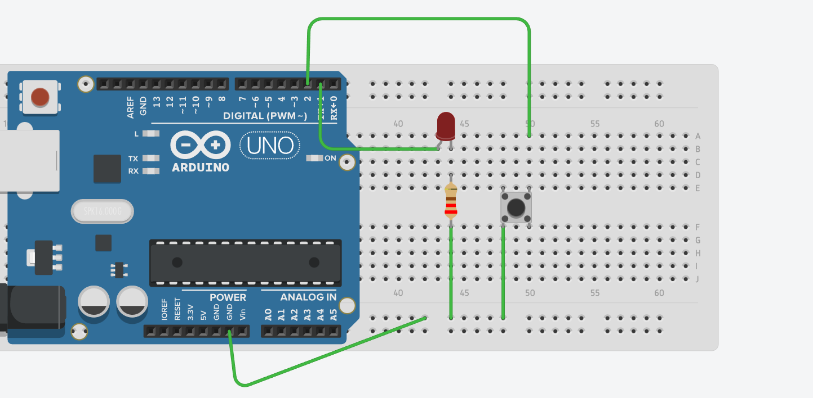

# Componets to prepare
- Arduino UNO R3
- Button
- LED
- Resistor 220 ohm
- Breadboard
- Wires

# Circuit diagram


# Code
```
int led = 1;
int button = 2;

void setup(){
  pinMode(led, OUTPUT);
  pinMode(button, INPUT_PULLUP);
}

void loop(){
  int state = digitalRead(button);
  if(state == LOW){
    digitalWrite(led, HIGH);
  }
  else{
    digitalWrite(led, LOW);
  }
}
```
