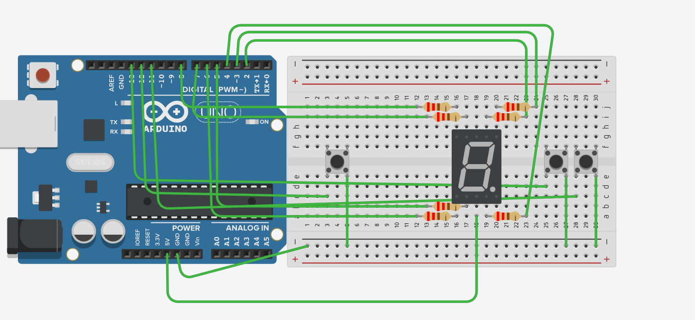

# Video
- Video demo in my youtube channel: [https://youtube.com/shorts/Zgn6H3aAmm4?si=2hNJIyBxSSIRXRRS
](https://youtube.com/shorts/Zgn6H3aAmm4?si=2hNJIyBxSSIRXRRS)
- Full video how to do this mini project: ...

# How to do
Components to prepare:
- Arduino UNO R3
- 7 segment LED common anode
- 3 buttons
- 7 resistors 220 ohm
- Breadboard
- Wires

Circuit_diagram:



Code
```


```
