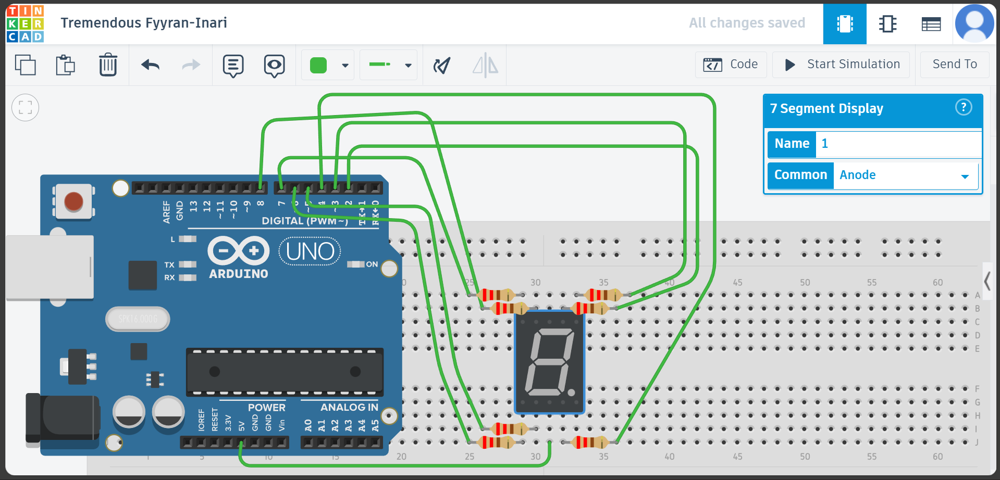

# Controlling 7 segment LED run from 0 to 9
Watch video demo here: https://www.youtube.com/shorts/a6PXKHLLvQA

---

# Components to prepare
- Arduino Uno R3
- LED 7 segment
- 7 Resistor
- Breadboard
- Wires

# Circuit diagram 

# Code

