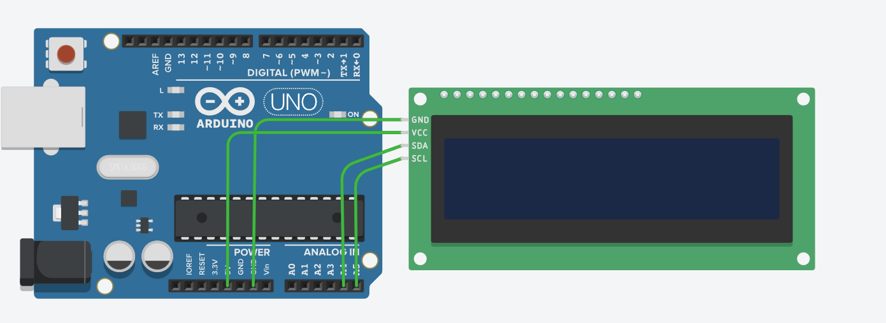

# Circuit diagram


# Code and explain
```
// Initialize the libraries needed for LCD1602 and I2C module
#include <Wire.h>
#include <LiquidCrystal_I2C.h>

// Create an LCD object with 3 parameters:
// 0x27 → I2C address of LCD (most common; sometimes 0x3F)
// 16 → number of columns of LCD
// 2 → number of rows of 
LiquidCrystal_I2C lcd(0x27, 16, 2);  // địa chỉ I2C phổ biến: 0x27 hoặc 0x3F

void setup() {
  lcd.init(); // LCD initialization, makes the LCD ready for operation. 
  lcd.backlight();  // Turn on the LCD backlight (if it is not on, the screen may not light up).
  lcd.setCursor(0, 0); // Set cursor position to print character: 0 → first column; 0 → first line
  lcd.print("Hello World");
}

void loop(){}
```
or if your want put "Hello world in loop
```
#include <Wire.h>
#include <LiquidCrystal_I2C.h>
LiquidCrystal_I2C lcd(0x27, 16, 2);  // địa chỉ I2C phổ biến: 0x27 hoặc 0x3F
void setup() {
  lcd.init();     
  lcd.backlight();  
  lcd.setCursor(0, 0); 
}
void loop() {
    lcd.clear(); // clear the screen
    lcd.setCursor(0,0); reset cursor
    lcd.print("Hello Tu Khiem");
    delay(1000);
}
```

